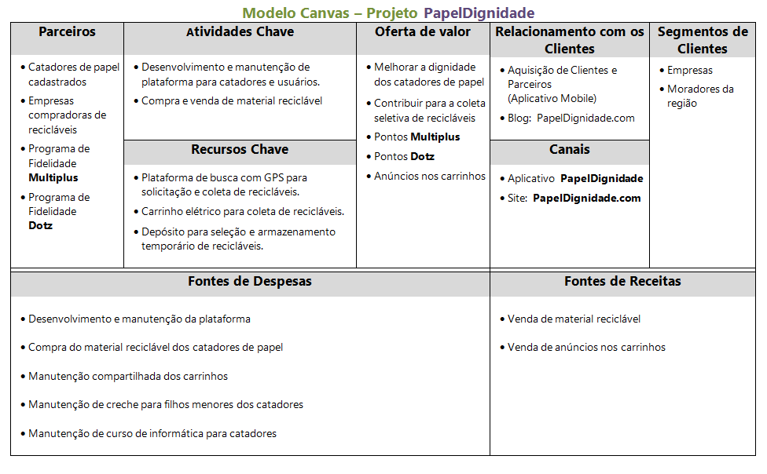

  

<h1 align="center">
:small_red_triangle_down:  Marketplace para Coleta de Resíduos Recicláveis
</h1>
<h3 align="center">
Bootcamp NLW-1 da Rocketseat
</h3>

  

  

O objetivo deste projeto é criar um site para conectar pessoas que precisam se livrar de seus recicláveis com pessoas ou empresas que trabalham com reciclagem, contribuindo assim para um ecossistema mais sustentável. É um desafio prático da Semana NLW (Next Level Week) promovida pela <b>Rocketseat</b> com o objetivo de acelerar a performance de desenvolvedores na Stack JavaScript + NodeJS.

  <a href="#cloud-deploy">Deploy</a>&nbsp;&nbsp;&nbsp;|&nbsp;&nbsp;&nbsp;
  <a href="#rocket-tecnologias">Tecnologias</a>&nbsp;&nbsp;&nbsp;|&nbsp;&nbsp;&nbsp;
  <a href="#computer-instalando">Instalando</a>&nbsp;&nbsp;&nbsp;|&nbsp;&nbsp;&nbsp;
  <a href="#books-aprendendo">Aprendendo</a>&nbsp;&nbsp;&nbsp;|&nbsp;&nbsp;&nbsp;
  <a href="#small_orange_diamond-contribuindo">Contribuindo</a>&nbsp;&nbsp;&nbsp;|&nbsp;&nbsp;&nbsp;
  <a href="#small_orange_diamond-customizando">Customizando</a>&nbsp;&nbsp;&nbsp;|&nbsp;&nbsp;&nbsp;
  <a href="#small_orange_diamond-licença">Licença</a>&nbsp;&nbsp;&nbsp;|&nbsp;&nbsp;&nbsp;
  <a href="#small_orange_diamond-trello">Trello</a>

  

## :cloud: Deploy
  
Foi usado o servidor da AWS para o pipeline com o GitHub e o deploy da aplicação. Para testar a aplicação acesse:

- [https://cd-snake-game.herokuapp.com/](https://cd-snake-game.herokuapp.com/)

## :rocket: Tecnologias

Nesse projeto foram usadas as seguintes tecnologias:

- [Html5](https://developer.mozilla.org/pt-BR/docs/Web/HTML/HTML5)
- [Css3](http://www.linhadecodigo.com.br/artigo/3566/introducao-as-novidades-do-css3.aspx)
- [JavaScript](https://developer.mozilla.org/pt-BR/docs/Web/JavaScript)
- [NodeJS](https://nodejs.org/en/download/)
- [Express](https://expressjs.com/pt-br/)
- [Nodemon](https://www.npmjs.com/package/nodemon)
- [Nunjucks](https://www.npmjs.com/package/nunjucks)

## :computer: Instalando

1. É requisito necessário ter instalados na máquina tanto o NodeJS como o NPM.
   Para informações sobre a instalação dos mesmos consulte o link: 
   [Instalando o NodeJS no Windows](https://github.com/clovisdanielcosta/nodejs/)

2. Faça o clone deste repositório numa pasta desejada:
  `$ git clone https://github.com/clovisdanielcosta/nlw-ecoleta.git`

3. Entre na pasta do app:
  `$ cd nlw-ecoleta`

4. Rode este comando para instalar as dependências:
  `$ npm install`

5. Rode este comando para subir o servidor Node:
  `$ npm start`

6. Na barra de endereço de um navegador digite:
  `$ localhost:3001`

## :books: Aprendendo

- Entendendo melhor o conceito de projeto Full MVC envolvendo Back-end e 
  Front-end na mesma aplicação.
- Aprendendo a usar Nunkucks para template engine que tornam as páginas html mais
  dinâmicas, aceitando variáveis e inserção de layouts padrão dos ítens que se
  repetem.

## :small_orange_diamond: Contribuindo

1. Criei um modelo de Canvas no passado  que poderia ser adaptado para um possível aprimoramento deste projeto.
   Se chama STARTUP - PapelDignidade.

   Objetivo: Nos mesmos moldes dos aplicativos de mobilidade, criar um app para que moradores e empresas solicitem a retirada de recicláveis e que selecione os catadores de papel mais próximos para a coleta. Os usuários participantes serão beneficiados com pontos em programas de fidelidade para cada coleta realizada. Os catadores utilizarão carrinhos elétricos semelhantes aos de entrega de bebidas nos grandes centros reduzindo o esforço empregado no processo de coleta. A empresa comprará os recicláveis dos catadores cadastrados e oferecerá uma infra-estrutura social para os parceiros participantes.

   A ideia pode ser vista na figura abaixo:

  

## :small_orange_diamond: Customizando

1. Uso de variáveis no CSS em todo o projeto para facilitar a estilização.
2. Implementação de tema DARK MODE para maior conforto visual.

## :small_orange_diamond: Licença

Esse projeto está sob a licença MIT. Veja o arquivo [LICENSE](LICENSE.md) para mais detalhes.
A(s) imagem(s) usada(s) neste projeto são originais do autor ou foram obtidas através do site da Pexels com a devida autorização para uso gratuito.

## :small_orange_diamond: Trello

  

## :small_orange_diamond: Agradecimentos

Quero agradecer a <b>Rocketseat</b> especialmente ao Mayk Brito pelas contribuições para o meu aprendizado neste projeto.
Também agradeço ao Gabriel Oliveira do site <b>OhMyCode</b> (nome fantástico!) pelas explicações sobre Grid Layout e Dark Tema. 
Parabéns pelo trabalho de vocês. 

Muito obrigado!:clap::clap:
